  

  
  
  

## Hi, I'm Xiao Jie

I build practical developer tools, observable backend services, and AI-assisted workflows. My recent work centers on **Go**, **Vue**, and making local or hosted AI systems easier to operate.

- Building reliable tooling for coding agents on Windows
- Exploring local image, video, speech, and language model workflows
- Turning backend infrastructure into focused, usable products

## Tech stack

  

## Selected work

| Project | What it does | Stack |
| :--- | :--- | :---: |
| [**agent-tools**](https://github.com/xiaojiecode/agent-tools) | Safer UTF-8 repository tooling and process cleanup for Codex on Windows | `Go` `PowerShell` |
| [**mono-rbac**](https://github.com/xiaojiecode/mono-rbac) | Modular monolith starter with JWT, RBAC, Redis, scheduling, monitoring, and Docker deployment | `Go` `Vue 3` |
| [**llm-availability-console**](https://github.com/xiaojiecode/llm-availability-console) | Availability and latency monitoring for OpenAI-compatible and Anthropic channels | `Go` `Vue 3` |
| [**agent-project-bootstrap**](https://github.com/xiaojiecode/agent-project-bootstrap) | Repository scanner that bootstraps maintainable guidance for coding agents | `Python` `Agent tooling` |
| [**go-monitor**](https://github.com/xiaojiecode/go-monitor) | Embeddable application monitoring with optional Gin APIs | `Go` `Gin` |
| [**lucen-gpt-image**](https://github.com/xiaojiecode/lucen-gpt-image) | Image generation client with editing, batching, retries, and endpoint fallback | `Python` `GPT Image` |

## GitHub activity

  <picture>
    <source media="(prefers-color-scheme: dark)" srcset="https://github-readme-stats.vercel.app/api?username=xiaojiecode&show_icons=true&hide_border=true&rank_icon=github&bg_color=00000000&title_color=58a6ff&text_color=c9d1d9&icon_color=3fb950" />
    <source media="(prefers-color-scheme: light)" srcset="https://github-readme-stats.vercel.app/api?username=xiaojiecode&show_icons=true&hide_border=true&rank_icon=github&bg_color=00000000&title_color=0969da&text_color=24292f&icon_color=1a7f37" />
    
  </picture>
  <picture>
    <source media="(prefers-color-scheme: dark)" srcset="https://github-readme-stats.vercel.app/api/top-langs/?username=xiaojiecode&layout=compact&hide_border=true&bg_color=00000000&title_color=58a6ff&text_color=c9d1d9&langs_count=8" />
    <source media="(prefers-color-scheme: light)" srcset="https://github-readme-stats.vercel.app/api/top-langs/?username=xiaojiecode&layout=compact&hide_border=true&bg_color=00000000&title_color=0969da&text_color=24292f&langs_count=8" />
    
  </picture>

<picture>
  <source media="(prefers-color-scheme: dark)" srcset="https://raw.githubusercontent.com/xiaojiecode/xiaojiecode/output/github-contribution-grid-snake-dark.svg" />
  <source media="(prefers-color-scheme: light)" srcset="https://raw.githubusercontent.com/xiaojiecode/xiaojiecode/output/github-contribution-grid-snake.svg" />
  
</picture>

  Build things that stay useful.

